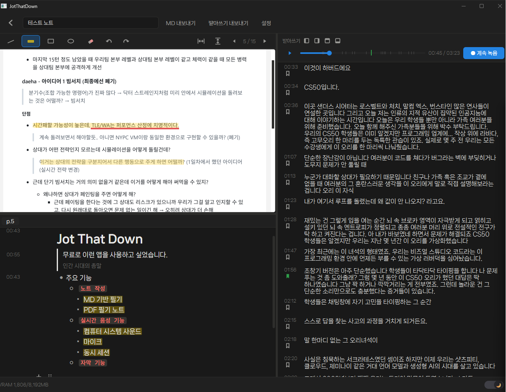
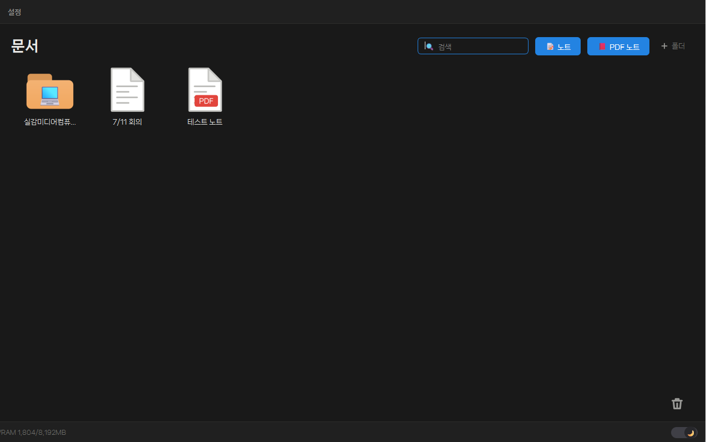
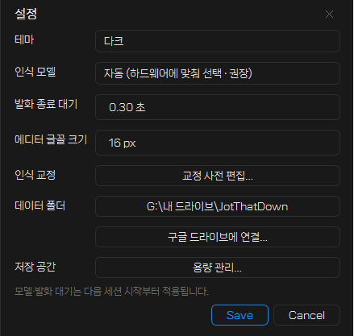

# Jot That Down

강의를 들으며 **실시간 자막(받아쓰기)** 과 **노트 필기**를 한 화면에서, 타임라인으로 묶어주는 Windows 데스크톱 앱.

모든 인식은 로컬에서 동작합니다 (faster-whisper) — 녹음·노트가 외부 서버로 나가지 않습니다.

## 화면



> 세션 화면 — 왼쪽은 PDF 필기(형광펜·밑줄)와 노션형 노트, 오른쪽은 실시간 받아쓰기.
> 자막마다 타임스탬프·북마크가 붙고, 위 재생 바에서 그 시점의 녹음을 다시 들을 수 있습니다.



> 홈 화면 — 폴더로 노트를 정리하고, [노트] / [PDF 노트]로 새 세션을 시작합니다.



> 설정 — 테마·인식 모델·교정 사전, 구글 드라이브 연결과 용량 관리까지 한곳에서.

## 기본 기능

- **실시간 받아쓰기** — 마이크와 시스템 소리(강의 영상 등)를 동시에 인식해 한/영 자막으로 기록. 문장마다 타임스탬프·북마크가 붙고, 클릭하면 그 시점의 녹음을 다시 들을 수 있습니다.
- **노션형 노트** — 블록 에디터(제목·글머리·체크리스트·토글·코드·인용·이미지)와 마크다운 단축 입력(`* `, `## `, `/page` 등). 필기한 블록도 시각이 기록되어 자막과 상호 이동됩니다.
- **PDF 필기 노트** — 강의 PDF 위에 밑줄·형광펜(글줄 스냅)·도형 주석, 페이지마다 붙는 노트.
- **세션 녹음·재생** — 전 과정이 OGG로 녹음되고, 재생 바에 자막·북마크 위치가 눈금으로 표시됩니다.
- **내보내기** — 노트는 Markdown, 받아쓰기는 타임스탬프 포함 txt로.
- **클라우드 동기화** — 설정에서 "구글 드라이브에 연결" 한 번이면 데이터 폴더가 드라이브로 이동, 다른 PC와 공유됩니다. 용량 관리(녹음/모델 캐시 정리)도 설정에 있습니다.
- 실시간 자막 오버레이(창 최소화 시), 라이트/다크 테마, 인식 교정 사전.

## 설치

요구 사항: **Windows 10/11**, **Python 3.10**. NVIDIA GPU가 있으면 large 모델(GPU), 없으면 CPU + small 모델로 자동 동작합니다.

```bat
git clone https://github.com/haddol7/Jot-That-Down.git
cd Jot-That-Down
python -m venv .venv
.venv\Scripts\pip install -r requirements.txt
JotThatDown.bat
```

첫 녹음 시작 시 인식 모델(~1.5GB)을 자동으로 내려받습니다.

배포용 단일 폴더 실행 파일이 필요하면 `packaging\build.cmd` 로 빌드할 수 있습니다 (PyInstaller).

## 사용한 오픈소스

| 프로젝트 | 용도 |
|---|---|
| [faster-whisper](https://github.com/SYSTRAN/faster-whisper) / [CTranslate2](https://github.com/OpenNMT/CTranslate2) | 음성 인식 (Whisper) |
| [Silero VAD](https://github.com/snakers4/silero-vad) + [ONNX Runtime](https://onnxruntime.ai/) | 발화 구간 검출 |
| [PySide6 (Qt)](https://doc.qt.io/qtforpython/) | 데스크톱 UI, PDF 렌더링 |
| [PyAudioWPatch](https://github.com/s0d3s/PyAudioWPatch) | WASAPI 캡처 (마이크·시스템 루프백) |
| [python-soundfile](https://github.com/bastibe/python-soundfile) (libsndfile) | OGG 녹음/재생 |
| [Editor.js](https://editorjs.io/) 및 공식 플러그인 (header, list, checklist, quote, marker, inline-code, toggle, drag-drop, undo) | 블록 노트 에디터 |
| [highlight.js](https://highlightjs.org/) | 코드 블록 하이라이팅 |
| [나눔스퀘어 네오](https://hangeul.naver.com/) (SIL OFL) | 글꼴 |
| nvidia-ml-py, NVIDIA cuBLAS/cuDNN | GPU 실행·모니터링 |

각 오픈소스의 라이선스는 해당 프로젝트를 따릅니다.
